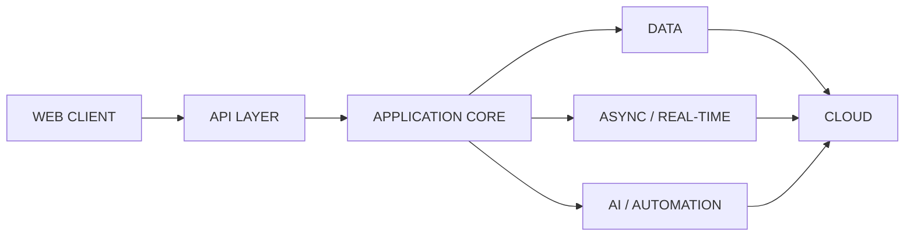
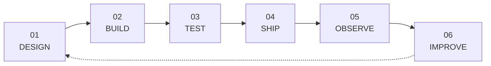

<div align="center">

# Dilan Dilruksha

`SOFTWARE ENGINEER` · `BACKEND` · `FULL-STACK` · `AI` · `CLOUD`

<br/>

[](https://git.io/typing-svg)

<br/>

[](https://dilandilruksha.dev)
[](https://linkedin.com/in/dilan-dilruksha)
[](mailto:dilandilruksha0@gmail.com)

</div>

<br/>

---

### `01 / engineer`

```txt
dilan@github:~$ whoami

Software Engineer building backend, full-stack,
AI-assisted and cloud-native software systems.

focus      -> backend / saas / ai / distributed systems
approach   -> ship / measure / improve / maintain
interface  -> APIs / web apps / real-time workflows
platform   -> Azure / AWS / Docker / Kubernetes
````

---

### `02 / stack`

<div align="center">


&nbsp;&nbsp;

&nbsp;&nbsp;

&nbsp;&nbsp;

&nbsp;&nbsp;

&nbsp;&nbsp;

&nbsp;&nbsp;

&nbsp;&nbsp;

&nbsp;&nbsp;

&nbsp;&nbsp;

&nbsp;&nbsp;

&nbsp;&nbsp;


</div>

<br/>

```yaml
stack:
  backend:
    - ASP.NET Core
    - FastAPI
    - Node.js
    - Spring Boot

  frontend:
    - Next.js
    - React
    - Angular
    - Blazor

  data:
    - SQL Server
    - PostgreSQL
    - MySQL
    - MongoDB
    - Redis

  engineering:
    - REST APIs
    - Multi-Tenant SaaS
    - Microservices
    - Event-Driven Architecture
    - WebSockets
    - RBAC
    - JWT Authentication

  cloud:
    - Azure
    - AWS
    - Docker
    - Kubernetes
    - GitHub Actions
    - Azure DevOps
    - CI/CD
```

---

### `03 / system.map`



<div align="center">

`Next.js / Angular / React`
  →  
`ASP.NET Core / FastAPI`
  →  
`PostgreSQL / Redis`
  →  
`Docker / Cloud`

</div>

---

### `04 / runtime`

```python
class Engineer:
    name = "Dilan Dilruksha"
    role = "Software Engineer"

    def __init__(self):
        self.building = [
            "backend systems",
            "multi-tenant platforms",
            "full-stack applications",
            "AI-assisted workflows",
            "cloud-native software",
        ]

        self.principles = [
            "reliable",
            "scalable",
            "maintainable",
            "observable",
        ]

    def ship(self):
        return "design -> build -> test -> deploy -> improve"
```

---

### `05 / engineering.loop`



---

### `06 / current.state`

```txt
STATUS     online
MODE       building
LOCATION   Colombo, Sri Lanka

INTERESTS
├── backend architecture
├── distributed systems
├── multi-tenant SaaS
├── AI-native applications
├── cloud infrastructure
└── developer tooling
```

---

### `07 / connect`

<div align="center">

```txt
Have an interesting engineering problem?
Let's build something useful.
```

[](https://dilandilruksha.dev)
[](https://linkedin.com/in/dilan-dilruksha)

<br/><br/>

<sub>software that ships · systems that scale · code that stays maintainable</sub>

</div>
